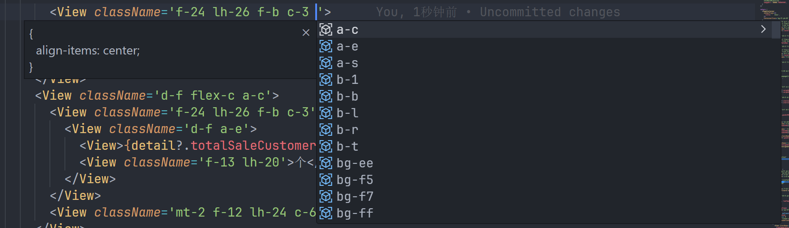
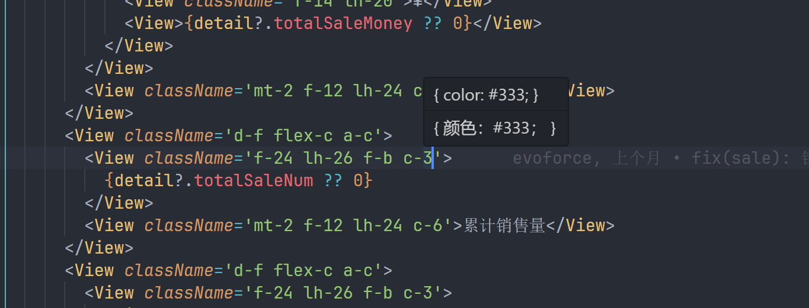

## 新米 css 提示扩展

> 提供 css 提示功能，帮助你更快速的书写 css，当前仅之前现有的 css 属性，计划后续支持在 xmcss.config.ts 中配置自定义属性。

#### 如何使用
1. 安装新米 css vscode 提示扩展 xmcss
2. 在你的项目根目录下创建 xmcss.config.ts 文件
3. 开始书写 css 代码，享受提示功能

#### 书写提示:

#### 悬浮提示:

#### 现阶段如何新增属性提示
1. 在 src/utils/app.less 中添加属性
2. 执行 src/utils/transform-less-to-css.ts 生成提示文件
3. 重新打包发布
